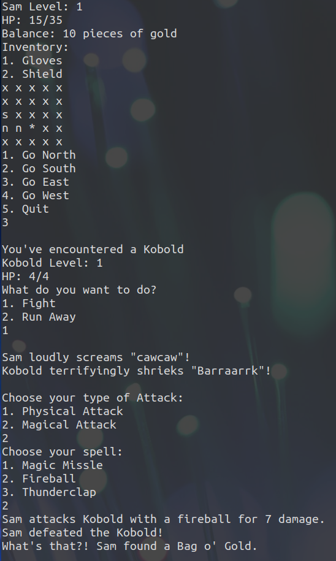

# Dungeon Master

Dungeon Master made by Samantha Hangsan, designed for OpenJDK 10. Gives user option to generate a configurable map. Also have the option to have fight monsters with physical and magical attacks, pick up armor and items, level up, heal self, run from battle, and buy or sell items.

## Installation

1. Copy the repository
2. Make sure you have Java version 10 or later

## Usage

`usage: Window.java`

Outputs and takes input from mouse and keyboard (numerical keypad and arrows)

## Example

Below are screenshots of my earlier versions of the Dungeon Master game.

## Authors

Samantha Hangsan

